# PDES2025s2-CTA
[](https://sonarcloud.io/summary/new_code?id=PDES-CTA_PDES2025s2-CTA)

## Compra Tu Auto - CTA

### Tech Stack

**Backend:**
- Kotlin + Spring Boot
- PostgreSQL / H2 (for testing)
- JPA/Hibernate
- Spring Security
- JUnit 5 + Mockito

**Frontend:**
- React + TypeScript
- Vite
- Vitest
- Playwright (E2E testing)

---

## Setup del proyecto

### Prerrequisitos

- Docker
- Docker Compose

### Ejecutar la aplicación

1. Clonar el repositorio:
```bash
git clone https://github.com/PDES-CTA/PDES2025s2-CTA.git
cd PDES2025s2-CTA
```

2. crear un `.env` file (opcional - usa valores por default si no se provee uno):
```env
# Database
POSTGRES_DB=cta
POSTGRES_USER=postgres
POSTGRES_PASSWORD=admin
POSTGRES_PORT=5432

# Backend
BACKEND_PORT=8080
JWT_SECRET=my-secret-key-minimum-32-characters-long
JWT_EXPIRATION=86400000

# Frontend
FRONTEND_PORT=3000
REACT_APP_BACKEND_URL=http://localhost:8080
```

3. Inicializar todos los servicios:
```bash
docker-compose up -d
```

4. Acceder a los servicios:
- **Frontend**: http://localhost:3000
- **Backend API**: http://localhost:8080
- **API Swagger**: http://localhost:8080/swagger-ui.html

5. Parar la aplicación:
```bash
docker-compose down
```

---

## Arquitectura

```mermaid
classDiagram
    %% MODEL AND ENTITIES
    class User {
        <<abstract>>
        -id: Long
        -email: String
        -password: String
        -firstName: String
        -lastName: String
        -phone: String
        -registrationDate: DateTime
        -active: Boolean
        +isActive(): Boolean
        +activate(): void
        +deactivate(): void
    }

    class BaseEntity {
        <<abstract>>
        -id: Long
        -createdAt: LocalDateTime
        -updatedAt: LocalDateTime
        +preUpdate(): void
    }

    class Buyer {
        -address: String
        -dni: Int
        +create(email, password, firstName, lastName, phone, address, dni): Buyer
    }

    class Dealership {
        -businessName: String
        -cuit: String
        -address: String
        -city: String
        -province: String
        -description: String
        +getFullAddress(): String
        +getDisplayName(): String
    }

    class Car {
        -brand: String
        -model: String
        -year: Integer
        -plate: String
        -mileage: Integer
        -color: String
        -fuelType: FuelType
        -transmission: TransmissionType
        -publicationDate: DateTime
        -available: Boolean
        +markAsSold(): void
        +markAsAvailable(): void
        +isAvailable(): Boolean
        +getFullName(): String
    }

    class CarOffer {
        -carId: Long
        -dealershipId: Long
        -price: BigDecimal
        -offerDate: LocalDateTime
        -dealershipNotes: String
        -images: MutableList<String>
        +updatePrice(newPrice: BigDecimal): void
    }

    class Purchase {
        -buyerId: Long
        -car: Car
        -dealership: Dealership
        -finalPrice: BigDecimal
        -purchaseDate: LocalDateTime
        -purchaseStatus: PurchaseStatus
        -paymentMethod: PaymentMethod
        -observations: String
        +confirmPurchase(): void
        +cancelPurchase(): void
        +deliverPurchase(): void
        +pendingPurchase(): void
    }

    %% ENUMS
    class FuelType {
        <<enumeration>>
        GASOLINE
        DIESEL
        HYBRID
        ELECTRIC
        GNC
    }

    class TransmissionType {
        <<enumeration>>
        MANUAL
        AUTOMATIC
        SEMI_AUTOMATIC
    }

    class PurchaseStatus {
        <<enumeration>>
        PENDING
        CONFIRMED
        DELIVERED
        CANCELLED
    }

    class PaymentMethod {
        <<enumeration>>
        CASH
        CHECK
        CREDIT_CARD
        BANK_TRANSFER
    }

    class UserRole {
        <<enumeration>>
        BUYER
        DEALERSHIP
        ADMINISTRATOR
    }

    %% REPOSITORIES
    class CarRepository {
        <<interface>>
        +findByAvailableTrue(): List<Car>
        +findById(id: Long): Optional<Car>
        +findAll(): List<Car>
        +save(car: Car): Car
        +delete(car: Car): void
    }

    class CarOfferRepository {
        <<interface>>
        +findAll(): List<CarOffer>
        +findById(id: Long): Optional<CarOffer>
        +findByCarIdAndDealershipId(carId: Long, dealershipId: Long): CarOffer?
        +save(carOffer: CarOffer): CarOffer
    }

    class PurchaseRepository {
        <<interface>>
        +findByIdOrNull(id: Long): Purchase?
        +findAll(): List<Purchase>
        +findByBuyerId(buyerId: Long): List<Purchase>
        +findByCarId(carId: Long): Purchase
        +findByDealershipId(dealershipId: Long): List<Purchase>
        +save(purchase: Purchase): Purchase
        +delete(purchase: Purchase): void
    }

    class DealershipRepository {
        <<interface>>
        +findById(id: Long): Optional<Dealership>
        +findAll(): List<Dealership>
        +findByActiveTrue(): List<Dealership>
        +findByCuit(cuit: String): Dealership?
        +findByEmail(email: String): Dealership?
        +save(dealership: Dealership): Dealership
        +delete(dealership: Dealership): void
    }

    class BuyerRepository {
        <<interface>>
        +findById(id: Long): Optional<Buyer>
        +findAll(): List<Buyer>
        +save(buyer: Buyer): Buyer
        +delete(buyer: Buyer): void
    }

    %% SERVICES
    class CarService {
        -carRepository: CarRepository
        +findById(id: Long): Car
        +getAllCars(): List<Car>
        +getCarById(id: Long): Car
    }

    class CarOfferService {
        -carOfferRepository: CarOfferRepository
        +findAll(): List<CarOffer>
        +findById(id: Long): CarOffer
        +findByCarIdAndDealershipId(carId: Long, dealershipId: Long): CarOffer?
    }

    class PurchaseService {
        -purchaseRepository: PurchaseRepository
        -carOfferService: CarOfferService
        -carService: CarService
        -buyerService: BuyerService
        -dealershipService: DealershipService
        +findById(id: Long): Purchase
        +findAll(): List<Purchase>
        +findByBuyerId(buyerId: Long): List<Purchase>
        +findByCarId(carId: Long): Purchase
        +findByDealershipId(dealershipId: Long): List<Purchase>
        +createPurchase(request: PurchaseCreateRequest): Purchase
        +updatePurchase(id: Long, updateData: Map<String, Any>): Purchase
        +deletePurchase(id: Long): void
        +markAsConfirmed(id: Long): Purchase
        +markAsPending(id: Long): Purchase
        +markAsCanceled(id: Long): Purchase
        +markAsDelivered(id: Long): Purchase
        -validatePurchase(purchase: Purchase): void
        -validateAndTransformPurchaseCreateRequest(request): Purchase
    }

    class DealershipService {
        -dealershipRepository: DealershipRepository
        +findById(id: Long): Dealership
        +findAll(): List<Dealership>
        +findActive(): List<Dealership>
        +findByCuit(cuit: String): Dealership?
        +findByEmail(email: String): Dealership?
        +createDealership(request: DealershipCreateRequest): Dealership
        +updateDealership(id: Long, updateData: Map<String, Any>): Dealership
        +deactivate(id: Long): Dealership
        +activate(id: Long): Dealership
        +deleteDealership(id: Long): void
    }

    class BuyerService {
        -buyerRepository: BuyerRepository
        +findById(id: Long): Buyer
        +findAll(): List<Buyer>
        +createBuyer(buyer: Buyer): Buyer
        +updateBuyer(id: Long, updateData: Map<String, Any>): Buyer
        +deleteBuyer(id: Long): void
    }

    class AuthService {
        +login(credentials: LoginCredentials): LoginResponse
        +register(data: RegisterData): User
        +logout(): void
        +getLoggedUser(): User
    }

    %% CONTROLLERS
    class AuthController {
        -authService: AuthService
        +login(credentials: LoginCredentials): ResponseEntity<LoginResponse>
        +register(request: BuyerCreateRequest): ResponseEntity<UserResponse>
    }

    class CarController {
        -carService: CarService
        +getAllCars(): ResponseEntity<List<CarResponse>>
        +getCarById(id: Long): ResponseEntity<CarResponse>
    }

    class CarOfferController {
        -carOfferService: CarOfferService
        +getAllCarOffers(): ResponseEntity<List<CarOfferResponse>>
        +getCarOfferById(id: Long): ResponseEntity<CarOfferResponse>
    }

    class PurchaseController {
        -purchaseService: PurchaseService
        +getAllPurchases(): ResponseEntity<List<PurchaseResponse>>
        +getPurchaseById(id: Long): ResponseEntity<PurchaseResponse>
        +getPurchaseByBuyerId(id: Long): ResponseEntity<List<PurchaseResponse>>
        +getPurchaseByCarId(id: Long): ResponseEntity<PurchaseResponse>
        +getPurchaseByDealershipId(id: Long): ResponseEntity<List<PurchaseResponse>>
        +createPurchase(request: PurchaseCreateRequest): ResponseEntity<PurchaseResponse>
        +updatePurchase(id: Long, request: Map): ResponseEntity<PurchaseResponse>
        +deletePurchase(id: Long): ResponseEntity<Unit>
        +markAsConfirmed(id: Long): ResponseEntity<PurchaseResponse>
        +markAsPending(id: Long): ResponseEntity<PurchaseResponse>
        +markAsCanceled(id: Long): ResponseEntity<PurchaseResponse>
        +markAsDelivered(id: Long): ResponseEntity<PurchaseResponse>
    }

    class DealershipController {
        -dealershipService: DealershipService
        +getAllDealerships(): ResponseEntity<List<DealershipResponse>>
        +getDealershipById(id: Long): ResponseEntity<DealershipResponse>
        +getDealershipByCuit(cuit: String): ResponseEntity<DealershipResponse>
        +getDealershipByEmail(email: String): ResponseEntity<DealershipResponse>
        +createDealership(request: DealershipCreateRequest): ResponseEntity<DealershipResponse>
        +updateDealership(id: Long, request: DealershipUpdateRequest): ResponseEntity<DealershipResponse>
        +deactivateDealership(id: Long): ResponseEntity<DealershipResponse>
        +activateDealership(id: Long): ResponseEntity<DealershipResponse>
        +deleteDealership(id: Long): ResponseEntity<Unit>
    }

    class BuyerController {
        -buyerService: BuyerService
        +getAllBuyers(): ResponseEntity<List<BuyerResponse>>
        +getBuyerById(id: Long): ResponseEntity<BuyerResponse>
        +createBuyer(request: BuyerCreateRequest): ResponseEntity<BuyerResponse>
        +updateBuyer(id: Long, request: BuyerUpdateRequest): ResponseEntity<BuyerResponse>
        +deleteBuyer(id: Long): ResponseEntity<Unit>
    }

    class GlobalExceptionHandler {
        +handleNoSuchElementException(e): ResponseEntity<ErrorResponse>
        +handleIllegalArgumentException(e): ResponseEntity<ErrorResponse>
        +handleGenericException(e): ResponseEntity<ErrorResponse>
    }

    %% INHERITANCE
    BaseEntity <|-- Car
    BaseEntity <|-- Purchase
    BaseEntity <|-- CarOffer
    User <|-- Buyer
    User <|-- Dealership

    %% ASSOCIATIONS
    Buyer "1" --> "*" Purchase : makes
    Dealership "1" --> "*" CarOffer : creates
    Dealership "1" --> "*" Purchase : receives
    Car "1" --> "*" CarOffer : has offers
    Car "1" --> "0..1" Purchase : is bought in
    CarOffer "*" --> "1" Car : references
    CarOffer "*" --> "1" Dealership : belongs to
    Purchase "1" --> "1" Car : involves
    Purchase "1" --> "1" Dealership : processed by

    %% ENUMS RELATIONSHIPS
    Car --> FuelType
    Car --> TransmissionType
    Purchase --> PurchaseStatus
    Purchase --> PaymentMethod
    User --> UserRole

    %% DEPENDENCIES
    AuthController --> AuthService
    CarController --> CarService
    CarOfferController --> CarOfferService
    PurchaseController --> PurchaseService
    DealershipController --> DealershipService
    BuyerController --> BuyerService
    
    PurchaseService --> PurchaseRepository
    PurchaseService --> CarOfferService
    PurchaseService --> CarService
    PurchaseService --> BuyerService
    PurchaseService --> DealershipService
    
    CarOfferService --> CarOfferRepository
    CarService --> CarRepository
    DealershipService --> DealershipRepository
    BuyerService --> BuyerRepository
```
