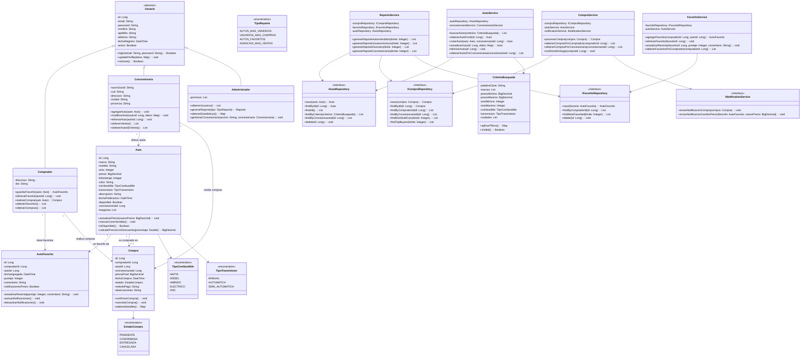

# PDES2025s2-CTA

```mermaid
classDiagram
    %% Entidades principales del dominio
    class Usuario {
        <<abstract>>
        -id: Long
        -email: String
        -password: String
        -nombre: String
        -apellido: String
        -telefono: String
        -fechaRegistro: DateTime
        -activo: Boolean
        +login(email: String, password: String): Boolean
        +updateProfile(datos: Map): void
        +isActive(): Boolean
    }

    class Comprador {
        -direccion: String
        -dni: String
        +guardarFavorito(auto: Auto): AutoFavorito
        +eliminarFavorito(autoId: Long): void
        +realizarCompra(auto: Auto): Compra
        +obtenerFavoritos(): List<AutoFavorito>
        +obtenerCompras(): List<Compra>
    }

    class Concesionaria {
        -razonSocial: String
        -cuit: String
        -direccion: String
        -ciudad: String
        -provincia: String
        +agregarAuto(auto: Auto): void
        +modificarAuto(autoId: Long, datos: Map): void
        +eliminarAuto(autoId: Long): void
        +obtenerVentas(): List<Compra>
        +obtenerAutosEnVenta(): List<Auto>
    }

    class Administrador {
        -permisos: List<String>
        +obtenerUsuarios(): List<Usuario>
        +generarReporte(tipo: TipoReporte): Reporte
        +obtenerEstadisticas(): Map<String, Object>
        +gestionarConcesionaria(accion: String, concesionaria: Concesionaria): void
    }

    class Auto {
        -id: Long
        -marca: String
        -modelo: String
        -anio: Integer
        -precio: BigDecimal
        -kilometraje: Integer
        -color: String
        -combustible: TipoCombustible
        -transmision: TipoTransmision
        -descripcion: String
        -fechaPublicacion: DateTime
        -disponible: Boolean
        -concesionariaId: Long
        -imagenes: List<String>
        +actualizarPrecio(nuevoPrecio: BigDecimal): void
        +marcarComoVendido(): void
        +isDisponible(): Boolean
        +calcularPrecioConDescuento(porcentaje: Double): BigDecimal
    }

    class AutoFavorito {
        -id: Long
        -compradorId: Long
        -autoId: Long
        -fechaAgregado: DateTime
        -puntaje: Integer
        -comentario: String
        -notificacionesPrecio: Boolean
        +actualizarResenia(puntaje: Integer, comentario: String): void
        +activarNotificaciones(): void
        +desactivarNotificaciones(): void
    }

    class Compra {
        -id: Long
        -compradorId: Long
        -autoId: Long
        -concesionariaId: Long
        -precioFinal: BigDecimal
        -fechaCompra: DateTime
        -estado: EstadoCompra
        -metodoPago: String
        -observaciones: String
        +confirmarCompra(): void
        +cancelarCompra(): void
        +obtenerDetalles(): Map<String, Object>
    }

    %% Enums
    class TipoCombustible {
        <<enumeration>>
        NAFTA
        DIESEL
        HIBRIDO
        ELECTRICO
        GNC
    }

    class TipoTransmision {
        <<enumeration>>
        MANUAL
        AUTOMATICA
        SEMI_AUTOMATICA
    }

    class EstadoCompra {
        <<enumeration>>
        PENDIENTE
        CONFIRMADA
        ENTREGADA
        CANCELADA
    }

    class TipoReporte {
        <<enumeration>>
        AUTOS_MAS_VENDIDOS
        USUARIOS_MAS_COMPRAS
        AUTOS_FAVORITOS
        AGENCIAS_MAS_VENTAS
    }

    %% Clases de servicio
    class AutoService {
        -autoRepository: IAutoRepository
        -concesionariaService: ConcesionariaService
        +buscarAutos(criterios: CriterioBusqueda): List<Auto>
        +obtenerAutoPorId(id: Long): Auto
        +crearAuto(auto: Auto, concesionariaId: Long): Auto
        +actualizarAuto(id: Long, datos: Map): Auto
        +eliminarAuto(id: Long): void
        +obtenerAutosPorConcesionaria(concesionariaId: Long): List<Auto>
    }

    class CompraService {
        -compraRepository: ICompraRepository
        -autoService: AutoService
        -notificationService: INotificationService
        +procesarCompra(compra: Compra): Compra
        +obtenerComprasPorComprador(compradorId: Long): List<Compra>
        +obtenerComprasPorConcesionaria(concesionariaId: Long): List<Compra>
        +confirmarEntrega(compraId: Long): void
    }

    class FavoritoService {
        -favoritoRepository: IFavoritoRepository
        -autoService: AutoService
        +agregarFavorito(compradorId: Long, autoId: Long): AutoFavorito
        +eliminarFavorito(favoritoId: Long): void
        +actualizarResenia(favoritoId: Long, puntaje: Integer, comentario: String): void
        +obtenerFavoritosPorComprador(compradorId: Long): List<AutoFavorito>
    }

    class ReporteService {
        -compraRepository: ICompraRepository
        -favoritoRepository: IFavoritoRepository
        -autoRepository: IAutoRepository
        +generarReporteAutosVendidos(limite: Integer): List<Auto>
        +generarReporteUsuariosActivos(limite: Integer): List<Comprador>
        +generarReporteFavoritos(limite: Integer): List<Auto>
        +generarReporteConcesionarias(limite: Integer): List<Concesionaria>
    }

    %% Interfaces para repositorios
    class IAutoRepository {
        <<interface>>
        +save(auto: Auto): Auto
        +findById(id: Long): Auto
        +findAll(): List<Auto>
        +findByCriteria(criterios: CriterioBusqueda): List<Auto>
        +findByConcesionariaId(id: Long): List<Auto>
        +delete(id: Long): void
    }

    class ICompraRepository {
        <<interface>>
        +save(compra: Compra): Compra
        +findById(id: Long): Compra
        +findByCompradorId(id: Long): List<Compra>
        +findByConcesionariaId(id: Long): List<Compra>
        +findMostSoldCars(limite: Integer): List<Auto>
        +findTopBuyers(limite: Integer): List<Comprador>
    }

    class IFavoritoRepository {
        <<interface>>
        +save(favorito: AutoFavorito): AutoFavorito
        +findByCompradorId(id: Long): List<AutoFavorito>
        +findMostFavorited(limite: Integer): List<Auto>
        +delete(id: Long): void
    }

    class INotificationService {
        <<interface>>
        +enviarNotificacionCompra(compra: Compra): void
        +enviarNotificacionCambioPrecio(favorito: AutoFavorito, nuevoPrecio: BigDecimal): void
    }

    %% Clase para criterios de busqueda 
    class CriterioBusqueda {
        -palabraClave: String
        -marcas: List<String>
        -precioMinimo: BigDecimal
        -precioMaximo: BigDecimal
        -anioMinimo: Integer
        -anioMaximo: Integer
        -combustible: TipoCombustible
        -transmision: TipoTransmision
        -ciudades: List<String>
        +aplicarFiltros(): Map<String, Object>
        +isValid(): Boolean
    }

    %% Relaciones de herencia
    Usuario <|-- Comprador
    Usuario <|-- Concesionaria
    Usuario <|-- Administrador

    %% Relaciones de asociacion
    Comprador "1" --> "*" AutoFavorito : tiene favoritos
    Comprador "1" --> "*" Compra : realiza compras
    Concesionaria "1" --> "*" Auto : ofrece autos
    Concesionaria "1" --> "*" Compra : recibe compras
    Auto "1" --> "*" AutoFavorito : es favorito de
    Auto "1" --> "0..1" Compra : es comprado en

    %% Relaciones con enums
    Auto --> TipoCombustible
    Auto --> TipoTransmision
    Compra --> EstadoCompra

    %% Dependencias de servicios
    AutoService --> IAutoRepository
    CompraService --> ICompraRepository
    CompraService --> INotificationService
    FavoritoService --> IFavoritoRepository
    ReporteService --> IAutoRepository
    ReporteService --> ICompraRepository
    ReporteService --> IFavoritoRepository

    %% Uso de criterios
    AutoService --> CriterioBusqueda
```
